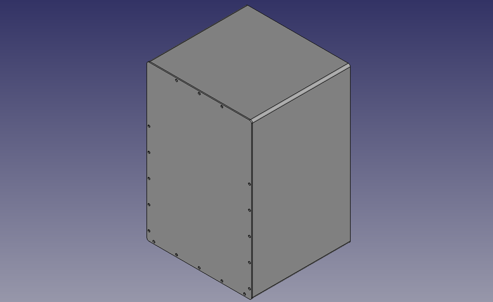
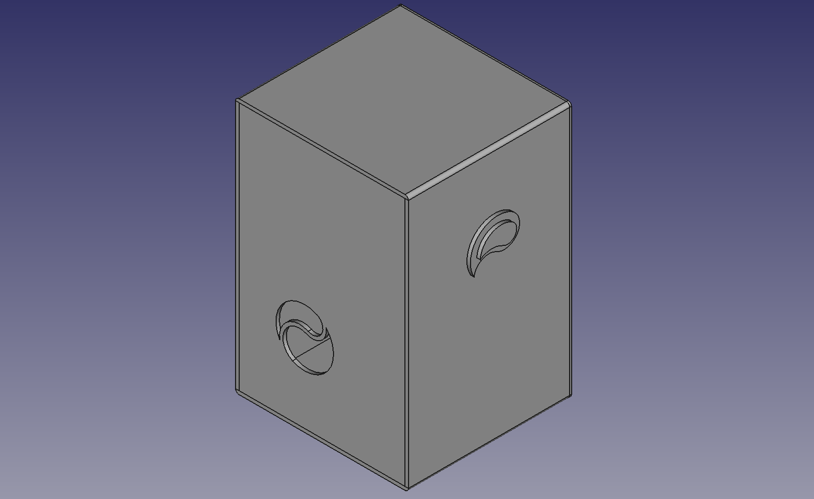

  
  
  

# cajon

_CAD designs for a DYI cajon ("box drum")_

### overview

this design is based on a scale drawing by Joe Cruz [\[PDF 📥\]][1], with some modifications made:

- 🎛️ add a knob for tightening/loosening the snare
- 🥁 use two 40-strand snare wires (instead of the standard single 20-strand), for extra crisp!
- 🕳️ make an interesting, asymmetric sound hole (instead of a boring round one)
- 🪑 customize the height to fit my personal ergonomics
- 🪵 adjust dimensions to meet the constraints of my available wood stock

### design constraints

- 📏 any continuous solids must not exceed the available plywood board dimensions: 300x600x6 millimeters
- 🧰 it must be buildable without the aid of power tools (a power drill is ok..)

                   
### current status

snapshot images of the current progress, auto-magically created with [CaptureSave][2].
                      
###### isometric view

                      
###### isometric view (flipped)

[1]: https://tnmarketing.s3.amazonaws.com/content/wwgoa/How-to-Build-a-Cajon-Drum-WWGOA.PDF
[2]: https://github.com/eliranmal/freecad-macros/blob/main/macros/CaptureSave.py
